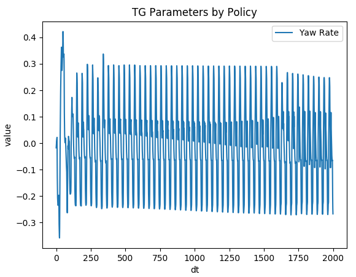

## Spot Mini Mini OpenAI Gym Environment

[](https://github.com/moribots/spot_mini_mini/releases)
[](https://spot-mini-mini.readthedocs.io/en/latest/?badge=latest)
[](https://github.com/moribots/spot_mini_mini/graphs/commit-activity)
[](https://github.com/moribots/spot_mini_mini/pulls)
[](https://github.com/moribots)
[](https://github.com/moribots/spot_mini_mini/blob/spot/LICENSE)


## Motivation

As part of the [Spot Micro](https://spotmicroai.readthedocs.io/en/latest/) community, I saw the need for a reliable and versatile simulator for those who wanted to try things out without risking damage to their robots. To that end, I developed my own in Pybullet which can also be used as a Gym environment for Reinforcement Learning tasks.

If you don't need a Gym environment, that's okay too! `env_tester.py` works without RL or Gym, is designed to accept any gait implementation, and provides a GUI for testing it out! In my case, I've implemented a 12-point Bezier gait.

Read the [docs](https://spot-mini-mini.readthedocs.io/en/latest/index.html)!

### Kinematics:

Pybullet Environment and body manipulation with leg IK from: https://www.researchgate.net/publication/320307716_Inverse_Kinematic_Analysis_Of_A_Quadruped_Robot


### Reinforcement Learning

#### Stability on Difficult Terrain
An interesting RL challenge was to induce stability on randomized and programmatically generated rough terrain. For this challenge, a simple Proportional controller was employed to deliver yaw correction as would be the case if the robot were teleoperated or able to localize itself.For increased policy robustness, the terrain, link masses and foot frictions are randomized on each environment reset.

Here, the action space is 14-dimensional, consisting of `Clearance Height` (1), `Body Height` (1), and `Foot XYZ Residual` modulations (12). `Clearance Height` is treated through an exponential filter (`alpha = 0.7`), but all other actions are processed directly. These results were trained with only 149 epochs.

Before training, the robot falls almost immediately:


After training, the robot successfully navigates the terrain:


#### Drift Correction
I've found that the Bezier Curve gait lends itself well to optimization via RL if I intentionally select sub-optimal gait parameters. Notice that the open-loop forward command drifts significantly over time (rougly 1m per 2m forward):


With a one-dimensional action space [`Yaw Rate`], and a 16-dimensional observation space [`IMU Inputs` (8), `Leg Phases` (4), `Leg Contacts` (4)], an `Augmented Random Search` agent (linear) was able to correct the trajectory after 299 epochs:


Here is the policy output for this demo. It's clearly biased on one end to account for Spot's drift:



### Gait:

Open-Loop Gait using 12-Point Bezier Curves based on: https://dspace.mit.edu/handle/1721.1/98270

Forward and Lateral Motion:


<!--  -->


Yaw logic based on 4-wheel steering car: http://www.inase.org/library/2014/santorini/bypaper/ROBCIRC/ROBCIRC-54.pdf


<!--  -->


### Controls
Assuming you have a Logitech Gamepad F310:

`A`: switch between stepping and RPY

`X`: E-STOP (engage and disengage)

**Stepping Mode**:

* `Right Stick Up/Down`: Step Length
* `Right Stick Left/Right`: Lateral Fraction
* `Left Stick Up/Down`: Robot Height
* `Left Stick Left/Right`: Yaw Rate
* `Arrow Pad Up/Down` (DISCRETE): Step Height
* `Arrow Pad Left/Right` (DISCRETE): Step Depth
* `Bottom Right/Left Bumpers`: Step Velocity (modulate)
* `Top Right/Left Bumpers`: reset all to default

**Viewing Mode**:

* `Right Stick Up/Down`: Pitch
* `Right Stick Left/Right`: Roll
* `Left Stick Up/Down`: Robot Height
* `Left Stick Left/Right`: Yaw

Changing `Step Velocity` while moving forward:


Changing `Step Length` while moving forward:


Yaw In Place: Slightly push the `Right Stick` forward while pushing the `Left Stick` maximally in either direction:


## How To Run

### Dependencies
* ROS Melodic
* Gazebo
* Pytorch
* Pybullet
* Gym
* OpenCV

### Control:
First, you're going to need a joystick (okay, not really, but it's more fun if you have one).

**Setting Up The Joystick:**
* Get Number (you will see something like jsX): `ls /dev/input/`
* Make available to ROS: `sudo chmod a+rw /dev/input/jsX`
* Make sure `<param name="dev" type="string" value="/dev/input/jsX"/>` matches your setup in the launchfile

Then simply: `roslaunch mini_ros spot_move.launch`

You can ignore this msg: `[ERROR] [1591631380.406690714]: Couldn't open joystick force feedback!` It just means your controller is missing some functionality, but this package doesn't use it.

**Non-Joystick Use**

If you don't have a joystick, go to `spot_bullet/src` and do `./env_tester.py`. A Pybullet sim will open up for you with the same controls you would have on the joystick, except each is on its own scrollbar. You may also use the following optional arguments:

```
-h, --help          show this help message and exit
-hf, --HeightField  Use HeightField
-r, --DebugRack     Put Spot on an Elevated Rack
-p, --DebugPath     Draw Spot's Foot Path
-ay, --AutoYaw      Automatically Adjust Spot's Yaw
-ar, --AutoReset    Automatically Reset Environment When Spot Falls
```

**Reinforcement Learning Agent Evaluation**

Go to `spot_bullet/src` and do `./spot_ars_eval.py`. You may also use the following optional arguments. Note that if you don't use the `-a` argument, no agent will be loaded, so you will be using the open-loop policy. For example, if you enter `149` after `-a`, you will see the first successful policy, but if you enter `2229`, you will see a much more aggressive policy.

```
-h, --help          show this help message and exit
-hf, --HeightField  Use HeightField
-r, --DebugRack     Put Spot on an Elevated Rack
-p, --DebugPath     Draw Spot's Foot Path
-a, --AgentNum      Agent Number To Load
```

**Using Different Terrain**

Navigate to `spotmicro/heightfield.py` and take a look at `useProgrammatic` and `useTerrainFromPNG` (you can play around with the mesh scales for each) to experiment with different terrains. Make sure that the `spotBezierEnv` instance has `height_field=True` in `env_tester.py` and `spot_pybullet_interface` depending on whether you're using the joystick/ROS version. The same goes for the RL environments. Note: these were adapted from the [pybullet](https://github.com/bulletphysics/bullet3/blob/master/examples/pybullet/examples/heightfield.py) source code.

`useTerrainFromPNG`


`useProgrammatic`


With this terrain type, I programmed in a randomizer that triggers upon reset. This, along with the body randomizer from `Pybullet's Minitaur` increases your RL Policy's robustness.


