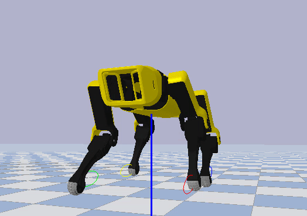
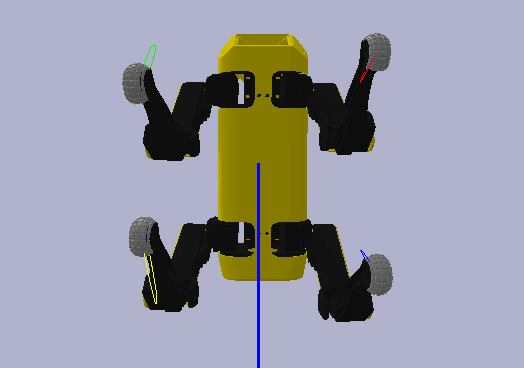
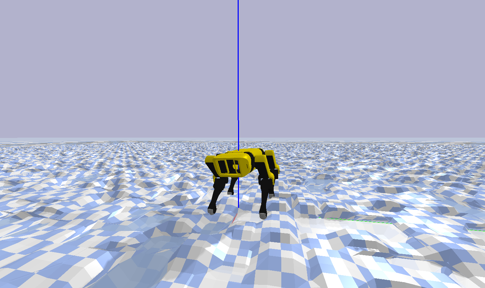

## Spot Mini Mini OpenAI Gym Environment

[](https://github.com/moribots/spot_mini_mini/releases)
[](https://spot-mini-mini.readthedocs.io/en/latest/?badge=latest)
[](https://github.com/moribots/spot_mini_mini/graphs/commit-activity)
[](https://github.com/moribots/spot_mini_mini/pulls)
[](https://github.com/moribots)
[](https://github.com/moribots/spot_mini_mini/blob/spot/LICENSE)

<!--  -->

<p float="left">
  
</p>

**Featured in [Robotics Weekly](https://weeklyrobotics.com/weekly-robotics-98) and [Mithi's Robotics Coursework](https://github.com/mithi/robotics-coursework/#hands-on-and-blogs)!**

## Motivation

As part of the [Spot Micro](https://spotmicroai.readthedocs.io/en/latest/) community, I saw the need for a reliable and versatile simulator for those who wanted to try things out without risking damage to their robots. To that end, I developed my own in Pybullet which can also be used as a Gym environment for Reinforcement Learning tasks.

<p float="left">
  
  
</p>

You'll notice that there are gifs of the original `SpotMicro` as well a new version designed for added real world fidelity. The default branch simulates the new version, but you can work with `SpotMicro` in the [spotmicroai](https://github.com/moribots/spot_mini_mini/tree/spotmicroai) branch of this repo. The new version also has a more reliable URDF, with more accurate inertial calculations.

If you don't need a Gym environment, that's okay too! `env_tester.py` works without RL or Gym, it is designed to accept any gait implementation, and provides a GUI for testing it out! In my case, I've implemented a 12-point Bezier gait.

<!-- 
<p float="left">
  
</p>
 -->
**Read the [docs](https://spot-mini-mini.readthedocs.io/en/latest/index.html)!**

Table of Contents
-----------------
  * [Motivation](#motivation)
  * [Kinematics](#kinematics)
  * [D^2 Gait Modulation with Bezier Curves](#d2-gait-modulation-with-bezier-curves)
    * [Training](#Training)
    * [Real World Validation](#real-world-validation)
  * [Gait](#gait)
  * [How To Run](#how-to-run)
     * [Dependencies](#dependencies)
     * [Joystick Control with ROS](#joystick-control-with-ros)
     * [Testing Environment (Non-Joystick)](#testing-environment-non-joystick)
     * [Reinforcement Learning Agent Training](#reinforcement-learning-agent-training)
     * [Reinforcement Learning Agent Evaluation](#reinforcement-learning-agent-evaluation)
     * [Using Different Terrain](#using-different-terrain)
  * [Hardware](https://github.com/moribots/spot_mini_mini/tree/spot/spot_real)
     * [Assembly & Calibration](https://github.com/moribots/spot_mini_mini/tree/spot/spot_real/Calibration.md)
  * [Citing Spot Mini Mini](#citing-spot-mini-mini)
  * [Credits](#credits)

### Kinematics

Body manipulation with [leg IK](https://www.researchgate.net/publication/320307716_Inverse_Kinematic_Analysis_Of_A_Quadruped_Robot) and [body IK](https://moribots.github.io/project/spot-mini-mini) descriptions.


### D^2 Gait Modulation with Bezier Curves

I'm using this platform to validate a novel Reinforcement Learning method for locomotion by myself and my co-authors Matthew L. Elwin, Ian Abraham, and Todd D. Murphey. Instead of learning a gait from scratch, we propose using an existing scheme as a baseline over which we optimize via training. The method is called `D^2 Gait Modulation with Bezier Curves`. To learn more, visit our [website](https://sites.google.com/view/d2gmbc)

<p float="left">
  
  
</p>

#### Training
During training, simple Proportional controller was employed to deliver yaw correction as would be the case if the robot were teleoperated or able to localize itself. For increased policy robustness, the terrain, link masses and foot frictions are randomized on each environment reset.

Here, the action space is 14-dimensional, consisting of `Clearance Height` (1), `Body Height` (1), and `Foot XYZ Residual` modulations (12). `Clearance Height` is treated through an exponential filter (`alpha = 0.7`), but all other actions are processed directly. These results were trained with only 149 epochs.

Before training, the robot falls almost immediately:


After training, the robot successfully navigates the terrain:


What's even better, is that the same agent `#149` is able to adapt to unseen commands, making high-level system integration straightforward. Here it is being teleoperated using `Forward`, `Lateral`, and `Yaw` commands.


Here's an example of the new URDF being teleoperated with a trained agent on 2x higher terrain:


#### Real World Validation
Here are some experimental results where the agent is on the right.

<p float="left">
  
  
</p>

### Gait

Open-Loop Gait using 12-Point Bezier Curves based on [MIT Cheetah Paper](https://dspace.mit.edu/handle/1721.1/98270) with [modifications](https://spot-mini-mini.readthedocs.io/en/latest/source/spotmicro.GaitGenerator.html#spotmicro.GaitGenerator.Bezier.BezierGait.GetPhase) for low step velocity discontinuity.

Forward and Lateral Motion:




Yaw logic based on [4-wheel steering car](http://www.inase.org/library/2014/santorini/bypaper/ROBCIRC/ROBCIRC-54.pdf):




## How To Run

### Dependencies
* ROS Melodic
* Gazebo
* Pytorch
* Pybullet
* Gym
* OpenCV
* Scipy
* Numpy

### Joystick Control with ROS
First, you're going to need a joystick (okay, not really, but it's more fun if you have one).

**Setting Up The Joystick:**

* Get Number (you will see something like jsX): `ls /dev/input/`
* Make available to ROS: `sudo chmod a+rw /dev/input/jsX`
* Make sure `<param name="dev" type="string" value="/dev/input/jsX"/>` matches your setup in the launchfile

Then simply: `roslaunch mini_ros spot_move.launch`

You can ignore this msg: `[ERROR] [1591631380.406690714]: Couldn't open joystick force feedback!` It just means your controller is missing some functionality, but this package doesn't use it.

**Controls:**

Assuming you have a Logitech Gamepad F310:

`A`: switch between stepping and RPY

`X`: E-STOP (engage and disengage)

**Stepping Mode**:

* `Right Stick Up/Down`: Step Length
* `Right Stick Left/Right`: Lateral Fraction
* `Left Stick Up/Down`: Robot Height
* `Left Stick Left/Right`: Yaw Rate
* `Arrow Pad Up/Down` (DISCRETE): Step Height
* `Arrow Pad Left/Right` (DISCRETE): Step Depth
* `Bottom Right/Left Bumpers`: Step Velocity (modulate)
* `Top Right/Left Bumpers`: reset all to default

**Viewing Mode**:

* `Right Stick Up/Down`: Pitch
* `Right Stick Left/Right`: Roll
* `Left Stick Up/Down`: Robot Height
* `Left Stick Left/Right`: Yaw

Changing `Step Velocity` while moving forward:


Changing `Step Length` while moving forward:


Yaw In Place: Slightly push the `Right Stick` forward while pushing the `Left Stick` maximally in either direction:


### Testing Environment (Non-Joystick)

If you don't have a joystick, go to `spot_bullet/src` and do `./env_tester.py`. A Pybullet sim will open up for you with the same controls you would have on the joystick, except each is on its own scrollbar. You may also use the following optional arguments:

```
-h, --help          show this help message and exit
-hf, --HeightField  Use HeightField
-r, --DebugRack     Put Spot on an Elevated Rack
-p, --DebugPath     Draw Spot's Foot Path
-ay, --AutoYaw      Automatically Adjust Spot's Yaw
-ar, --AutoReset    Automatically Reset Environment When Spot Falls
```

### Reinforcement Learning Agent Training

Go to `spot_bullet/src` and do `./spot_ars.py`. Models will be saved every `9th` episode to `spot_bullet/models/`. I will add some more arguments in the future to give you finer control of the heightfield mesh from the command line.

### Reinforcement Learning Agent Evaluation

Go to `spot_bullet/src` and do `./spot_ars_eval.py`. You may also use the following optional arguments. Note that if you don't use the `-a` argument, no agent will be loaded, so you will be using the open-loop policy. For example, if you enter `149` after `-a`, you will see the first successful policy, but if you enter `2229`, you will see a much more aggressive policy.

```
-h, --help          show this help message and exit
-hf, --HeightField  Use HeightField
-r, --DebugRack     Put Spot on an Elevated Rack
-p, --DebugPath     Draw Spot's Foot Path
-gui, --GUI         Control The Robot Yourself With a GUI
-a, --AgentNum      Agent Number To Load (followed by number)
```

### Using Different Terrain

Navigate to `spotmicro/heightfield.py` and take a look at `useProgrammatic` and `useTerrainFromPNG` (you can play around with the mesh scales for each) to experiment with different terrains. Make sure that the `spotBezierEnv` instance has `height_field=True` in `env_tester.py` and `spot_pybullet_interface` depending on whether you're using the joystick/ROS version. The same goes for the RL environments. Note: these were adapted from the [pybullet](https://github.com/bulletphysics/bullet3/blob/master/examples/pybullet/examples/heightfield.py) source code.

`useTerrainFromPNG`


`useProgrammatic`



With this terrain type, I programmed in a randomizer that triggers upon reset. This, along with the body randomizer from `Pybullet's Minitaur` increases your RL Policy's robustness.


## Citing Spot Mini Mini
```
@software{spotminimini2020github,
  author = {Maurice Rahme and Ian Abraham and Matthew Elwin and Todd Murphey},
  title = {SpotMiniMini: Pybullet Gym Environment for Gait Modulation with Bezier Curves},
  url = {https://github.com/moribots/spot_mini_mini},
  version = {2.1.0},
  year = {2020},
}
```

## Credits

* Original Spot Design and CAD files: [Spot Micro AI Community](https://spotmicroai.readthedocs.io/en/latest/)

* Collaborator on `OpenQuadruped` design, including mechanical parts, custom PCB, and Teensy interface: [Adham Elarabawy](https://github.com/adham-elarabawy/OpenQuadruped)

* OpenAI Gym and Heightfield Interface: [Minitaur Environment](https://github.com/bulletphysics/bullet3/blob/master/examples/pybullet/gym/pybullet_envs/bullet/minitaur.py)

* Deprecated URDF for earlier development: [Rex Gym](https://github.com/nicrusso7/rex-gym)
