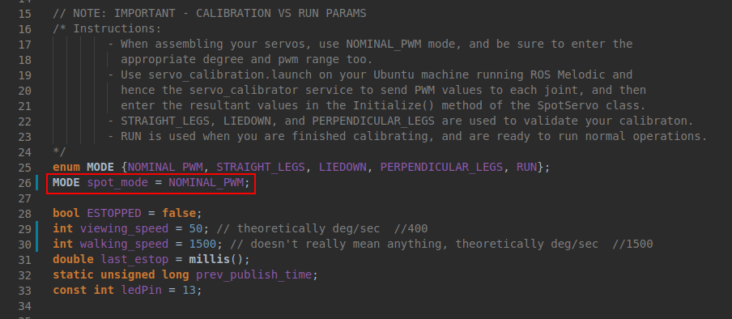
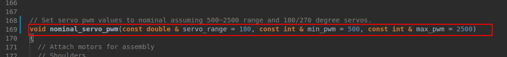
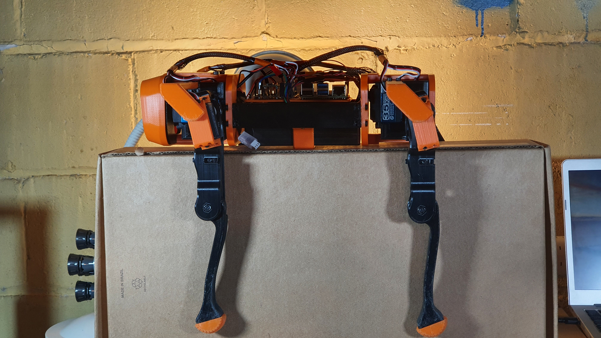
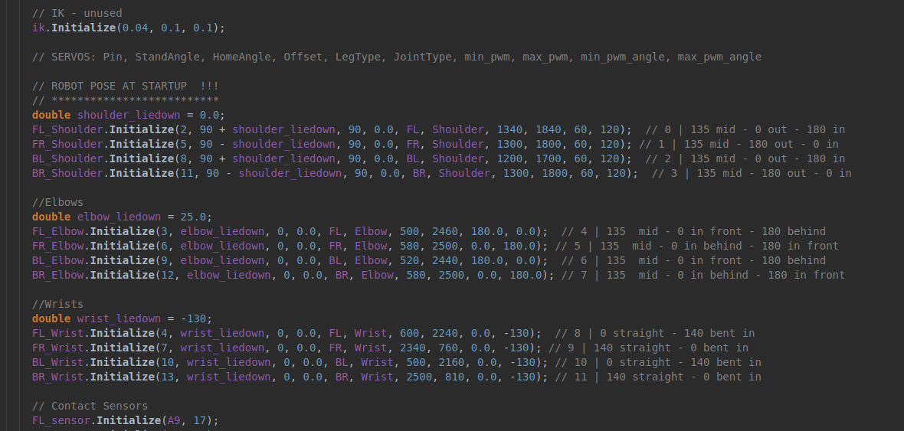
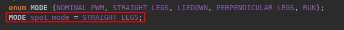
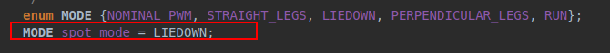
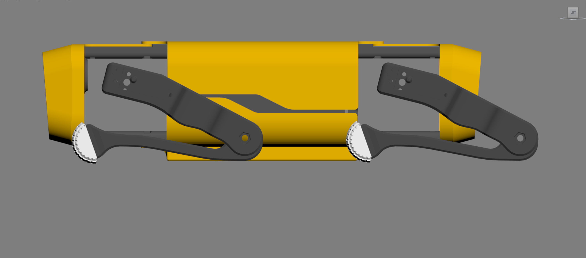
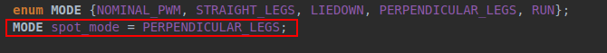
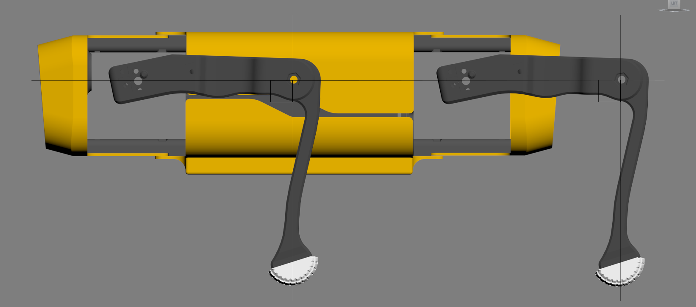

# Spot Mini Mini - The Real Deal

### Assembly Instructions

I'm in the middle of moving so it's difficult for me to get detailed images/instructions. For now, please consult the [CAD Model](https://cad.onshape.com/documents/9d0f96878c54300abf1157ac/w/c9cdf8daa98d8a0d7d50c8d3/e/fa0d7caf0ed2ef46834ecc24), which should be straightforward to look at and intuit.

During assembly, make sure the motors are powered and that you select `NOMINAL_PWM` mode in the [main.cpp](https://github.com/moribots/spot_mini_mini/blob/spot/spot_real/Control/Teensy/SpotMiniMini/src/main.cpp) file that runs on the `Teensy`. **NOTE:** Be sure to consult `nominal_servo_pwm()` to input your correct servo angle and pwm ranges for a successful calibration. For example, I am using `270` degree motors with `500` min and `2500` max PWM as shown below.





When the assembly in this mode is finished, the robot should have its legs extended and perpendicular to the body, like this:



#### Motor Plug In Order
```
M01 front left shoulder
M02 front left elbow
M03 front left wrist
M04 front right shoulder
M05 front right elbow
M06 front right wrist
M07 back left shoulder
M08 back left elbow
M09 back left wrist
M10 back right shoulder
M11 back right elbow
M12 back right wrist
```

#### Recommended Build Order
* Main Body
* Legs
* Inner Hips
* Outer Hips
* Covers

#### Main Body
* press-fit M3 nuts onto both sides of the main electronics plate, and M2 nuts onto the bottom of the adapter plate.
* Fasten the IMU onto the middle of the electronics plate. Regardless of your make/model, calibrate it to make sure your inertial axes follow the right hand rule.
* Fasten the adapter plate onto the main plate using 16mm M3 bolts.
* Fasten the battery to the bottom of the main plate using the battery holder and some M3 bolts.
* Fasten the Raspberry Pi and Spot Mini Mini boards onto the adapter plate using 8mm M2 bolts.
* Do your wiring now to avoid a hassle later. **TODO: Wiring Instructions - (simple enough to figure out in the meantime by following [The Diagram](https://easyeda.com/adhamelarabawy/PowerDistributionBoard))**.

#### Legs
* Fasten two of your motors into each shoulder joint.
* Fasten a disc servo horn onto the upper leg.
* Fasten the upper leg onto the shoulder motor (the one that does not have an opposing nub) through the disc horn. The upper leg should be perpendicular to the shoulder.
* Squeeze in an M3 nut onto the floor of the inner upper leg and an M5 nut onto the idler adjustor. Then, fit a bearing onto the idler using an 8mm M5 bolt.
* Push the idler onto the floor of the inner upper leg. While you're here, press-fit an M5 nut onto the bottom of the upper leg.
* Fasten a disc servo horn onto the belt pulley.
* Fasten the assembled pulley onto each leg's third motor. Place a bearing inside the pulley once this is done.
* After placing a belt around the motor's pulley, press-fit the pulley onto the upper leg.
* Press-fit two bearings into either side of the lower leg pulley.
* Slot the belt around the lower leg (try to keep it parallel to the upper leg) and secure it through the upper leg with a 30mm M5 bolt. This should be easy if your idler is untentioned.
* Tension your idler.
* The leg should be fully extended, with the upper and lower leg being parallel to each other and perpendicular to the shoulder.
* Once you're happy with this, fasten the servo cover onto the protruding motor, press-fit the bearing, and fasten the support bridge between the bearing and the shoulder joint.

#### Inner Hips
* Fasten two disc servo horns into the rear inner hip.
* Fasten the rear left and right legs to the rear inner hip, making sure the legs are parallel to the side of the body.
* Fasten the rear inner hip to both side chassis brackets.
* Slot the finished Main Body assembly into the chassis bracket lips. Secure with nuts and bolts.
* Fasten the front inner hip to both side chassis brackets. The main body should now be fully secured.
* Press-fit two bearings into the front inner hip.

#### Outer Hips
* Fasten two disc servo horns into the front outer hip.
* Fasten the front left and right legs to the front outer hip, making sure the legs are parallel to the side of the body.
* After slotting M3 nuts into the front inner hip, secure the front outer hip assembly (with the legs) using 16mm M3 bolts. Note that the nubs on the shoulder joints should fit into the bearings.
* Press-fit two bearings into the rear outer hip.
* After slotting M3 nuts into the rear inner hip, secure the rear outer hip assembly (with the legs) using 16mm M3 bolts. Note that the nubs on the shoulder joints should fit into the bearings.

### Motor Calibration Modes and Method

After turning on Spot's power switch, and `ssh`-ing into the Raspberry Pi (assuming you've done all the standard ROS stuff: `source devel/setup.bash` and `catkin_make`), do: `roslaunch mini_ros spot_calibrate.launch`. This will establish the serial connection between the Pi and the Teensy, and you should be able to give Spot's joints some PWM commands.

* After launching the calibration node, use `rosservice call /servo_calibrator <TAB> <TAB>` (the double `TAB` auto-completes the format) on each joint `0-11` and give it a few different PWM commands (carefully) to inspect its behavior.
* Once you are familiar with the joint, hone in on a PWM command that sends it to `two` known and measurable positions (`0` and `90` degrees works great - for the wrists, `165` degrees is also an option).
* Record the PWM value and corresponding position for each joint in the `Initialize()` method for the joints in `main.cpp` in the following order: `[PWM0, PWM1, ANG0, ANG1]`. Your motors will inevitably have non-linearities so it is imperative to perform these steps for each joint and to find two reference points that minimize the presence of non-linearities.

Here is an example for two joint calibrations I did:



Within [main.cpp](https://github.com/moribots/spot_mini_mini/blob/spot/spot_real/Control/Teensy/SpotMiniMini/src/main.cpp) (runs on Teensy), you can select the following modes to **verify** your calibration. Spending extra time here goes a long way.

* `STRAIGHT_LEGS`: Spot will start by lying down, and then extend its legs straight after a few seconds.




* `LIEDOWN`: Spot will stay lying down.





* `PERPENDICULAR_LEGS`: Spot will start by lying down, and then make its upper leg perpendicular to its shoulder, and its lower leg perpendicular to its upper leg. **NOTE: Make sure Spot is on a stand during this mode as it will fall over!**






* `RUN`: Spot will start by lying down, and raise itself to its normal stance once all sensors/communications are ready. This is the default mode.


Thank you [Vincent](https://github.com/elpimous) for your feedback regarding this guide's clarity!