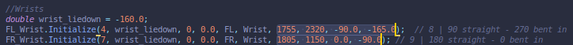

# Spot Mini Mini - The Real Deal

## Software

### Teensy Low Level Speed Controller: `Teensy`

Custom Serialized ROS messages have been built using `ROSSerial` for ROS Melodic. These allow the Teensy to communicate with the Raspberry Pi safely and efficiently. The Teensy firmware is split into multiple header files for Servo Motor Operations, Inverse Kinematics, IMU and Contact Sensor readings, as well as the ROSSerial Interface. Becuase of this split, I have opted to use `PlatformIO` for compilation instead of the Arduino IDE.

The `RPi` directory has some testing scripts which you will most likely not use.

#### Installation Instructions:

* Install `PlatformIO`.
* Install `Ubuntu 18.04` and `ROS Melodic` on Raspberry Pi and well as `ROSSerial`.
* Navigate to [firmware](https://github.com/moribots/spot_mini_mini/tree/spot/spot_real/Control/Teensy/SpotMiniMini) directory and run `platformio run -t upload` while connected to Teensy 4.0.

#### Launch Instructions:

After turning on Spot's power switch, and `ssh`-ing into the Raspberry Pi (assuming you've done all the standard ROS stuff: `source devel/setup.bash` and `catkin_make`), do: `roslaunch mini_ros spot_real.launch`. This will establish the serial connection between the Pi and the Teensy, and you should be able to give Spot joystick commands.


## Hardware

### Power Distribution Board: `PDB`

[Adham Elarabawy](https://github.com/adham-elarabawy/OpenQuadruped/blob/master/README.md) and I designed this Power Distribution Board for the [Spot Micro](https://spotmicroai.readthedocs.io/en/latest/). There are two available versions, one that supports a single power supply (mine - available in the `PDB` directory), and one that supports dual power supplies (his). The second version exists because users who do not use HV servos will need UBECs to buck the 2S Lipo's voltage down to whatever their motors require. In general, these UBECs come with limited current support, which means that two of them are requrired.

This power distribution board has a `1.5mm Track Width` to support up to `6A` at a `10C` temperature increase (conservative estimate). There are also copper grounding planes on both sides of the board to help with heat dissipation, and parallel tracks for the power lines are provided for the same reason. The PDB also includes shunt capactiors for each servo motor to smooth out the power input. You are free to select your own capaciors as recommendations range from `100uF` to `470uF` depending on the motors. Make sure you use electrolytic capacitors. Check out the [EasyEDA Project](https://easyeda.com/adhamelarabawy/PowerDistributionBoard)!


This board interfaces with a sensor array (used for foot sensors on this project) and contains two  I2C terminals and a regulated 5V power rail. At the center of the board is a Teensy 4.0 which communicates with a Raspberry Pi over Serial to control the 12 servo motors and read the analogue sensors. The Teensy allows for motor speed control, but if you don't need this, it defaults at 100deg/sec (you can change this). The Gerber files for the single supply version are in this directory.

### STEP/STL Files for new design:

Together with [Adham Elarabawy](https://github.com/adham-elarabawy/OpenQuadruped), I have a completed a total mechanical redesign of SpotMicro. We call it `OpenQuadruped`! Check out the [STEP](https://cad.onshape.com/documents/9d0f96878c54300abf1157ac/w/c9cdf8daa98d8a0d7d50c8d3/e/fa0d7caf0ed2ef46834ecc24) files here!


Main improvements:
* Shortened the body by 40mm while making more room for our electronics with adapter plates.
* Moved all the servos to the hip to save 60g on the lower legs, which are now actuated using belt-drives.
* Added support bridge on hip joint for added longevity.
* Added flush slots for hall effect sensors on the feet.


### Bill of Materials

See most recent [BOM](https://docs.google.com/spreadsheets/d/1Z4y59K8bY3r_442I70xe564zAFuP0pVIFEJ6bNZaCi0/edit?usp=sharing)!


Note that the actual cost of this project is reflected in the first group of items totalling `590 USD`. For users such as myself who did not own any hobbyist components before this project, I have included an expanded list of required purchases.

### Assembly Instructions (MOSTLY COMPLETE)

I'm in the middle of moving so it's difficult for me to get detailed images/instructions. For now, please consult the [CAD Model](https://cad.onshape.com/documents/9d0f96878c54300abf1157ac/w/c9cdf8daa98d8a0d7d50c8d3/e/fa0d7caf0ed2ef46834ecc24), which should be straightforward to look at and intuit.

During assembly, make sure the motors are powered and that you select `NOMINAL_PWM` mode in the `main.cpp` file that runs on the `Teensy`. **NOTE:** Be sure to consult `nominal_servo_pwm()` to input your correct servo angle and pwm ranges for a successful calibration. For example, I am using `270` degree motors with `500` min and `2500` max PWM.

#### Motor Plug In Order
```
M01 front left shoulder
M02 front left elbow
M03 front left wrist
M04 front right shoulder
M05 front right elbow
M06 front right wrist
M07 back left shoulder
M08 back left elbow
M09 back left wrist
M10 back right shoulder
M11 back right elbow
M12 back right wrist
```

#### Recommended Order
* Main Body
* Legs
* Inner Hips
* Outer Hips
* Covers

#### Main Body
* press-fit M3 nuts onto both sides of the main electronics plate, and M2 nuts onto the bottom of the adapter plate.
* Fasten the IMU onto the middle of the electronics plate. Regardless of your make/model, calibrate it to make sure your inertial axes follow the right hand rule.
* Fasten the adapter plate onto the main plate using 16mm M3 bolts.
* Fasten the battery to the bottom of the main plate using the battery holder and some M3 bolts.
* Fasten the Raspberry Pi and Spot Mini Mini boards onto the adapter plate using 8mm M2 bolts.
* Do your wiring now to avoid a hassle later. **TODO: Wiring Instructions - (simple enough to figure out in the meantime)**.

#### Legs
* Fasten two of your motors into each shoulder joint.
* Fasten a disc servo horn onto the upper leg.
* Fasten the upper leg onto the shoulder motor (the one that does not have an opposing nub) through the disc horn. The upper leg should be perpendicular to the shoulder.
* Squeeze in an M3 nut onto the floor of the inner upper leg and an M5 nut onto the idler adjustor. Then, fit a bearing onto the idler using an 8mm M5 bolt.
* Push the idler onto the floor of the inner upper leg. While you're here, press-fit an M5 nut onto the bottom of the upper leg.
* Fasten a disc servo horn onto the belt pulley.
* Fasten the assembled pulley onto each leg's third motor. Place a bearing inside the pulley once this is done.
* After placing a belt around the motor's pulley, press-fit the pulley onto the upper leg.
* Press-fit two bearings into either side of the lower leg pulley.
* Slot the belt around the lower leg (try to keep it parallel to the upper leg) and secure it through the upper leg with a 30mm M5 bolt. This should be easy if your idler is untentioned.
* Tension your idler.
* The leg should be fully extended, with the upper and lower leg being parallel to each other and perpendicular to the shoulder.
* Once you're happy with this, fasten the servo cover onto the protruding motor, press-fit the bearing, and fasten the support bridge between the bearing and the shoulder joint.

#### Inner Hips
* Fasten two disc servo horns into the rear inner hip.
* Fasten the rear left and right legs to the rear inner hip, making sure the legs are parallel to the side of the body.
* Fasten the rear inner hip to both side chassis brackets.
* Slot the finished Main Body assembly into the chassis bracket lips. Secure with nuts and bolts.
* Fasten the front inner hip to both side chassis brackets. The main body should now be fully secured.
* Press-fit two bearings into the front inner hip.

#### Outer Hips
* Fasten two disc servo horns into the front outer hip.
* Fasten the front left and right legs to the front outer hip, making sure the legs are parallel to the side of the body.
* After slotting M3 nuts into the front inner hip, secure the front outer hip assembly (with the legs) using 16mm M3 bolts. Note that the nubs on the shoulder joints should fit into the bearings.
* Press-fit two bearings into the rear outer hip.
* After slotting M3 nuts into the rear inner hip, secure the rear outer hip assembly (with the legs) using 16mm M3 bolts. Note that the nubs on the shoulder joints should fit into the bearings.

### Motor Calibration Modes and Method

Within [main.cpp](https://github.com/moribots/spot_mini_mini/blob/spot/spot_real/Control/Teensy/SpotMiniMini/src/main.cpp) (runs on Teensy), you can select the following modes:

* `NOMINAL_PWM`: Sets the motors to roughly the straight-leg position (see note above on different motor limits).
* `STRAIGHT_LEGS`: Spot will start by lying down, and then extend its legs straight after a few seconds.
* `LIEDOWN`: Spot will stay lying down.
* `PERPENDICULAR_LEGS`: Spot will start by lying down, and then make its upper leg perpendicular to its shoulder, and its lower leg perpendicular to its upper leg. **NOTE: Make sure Spot is on a stand during this mode as it will fall over!**
* `RUN`: Spot will start by lying down, and raise itself to its normal stance once all sensors/communications are ready. This is the default mode.

Use any and all of these modes to help verify your motor calibration. The method is fairly basic, but can be cumbersome if your motors have nonlinearities like mine.

After turning on Spot's power switch, and `ssh`-ing into the Raspberry Pi (assuming you've done all the standard ROS stuff: `source devel/setup.bash` and `catkin_make`), do: `roslaunch mini_ros spot_calibrate.launch`. This will establish the serial connection between the Pi and the Teensy, and you should be able to give Spot's joints PWM commands.

#### Process for each joint:
* After launching the calibration node, use `rosservice call /servo_calibrator <TAB> <TAB>` (the double `TAB` auto-completes the format) on each joint `0-11` and give it a few different PWM commands (carefully) to inspect its behavior.
* Once you are familiar with the joint, hone in on a PWM command that sends it to `two` known and measurable positions (`0` and `90` degrees works great - for the wrists, `165` degrees is also an option).
* Record the PWM value and corresponding position for each joint in the `Initialize()` method for the joints in `main.cpp` in the following order: `[PWM0, PWM1, ANG0, ANG1]`.

Here is an example for two joint calibrations I did (see highlighted portion for reference):

