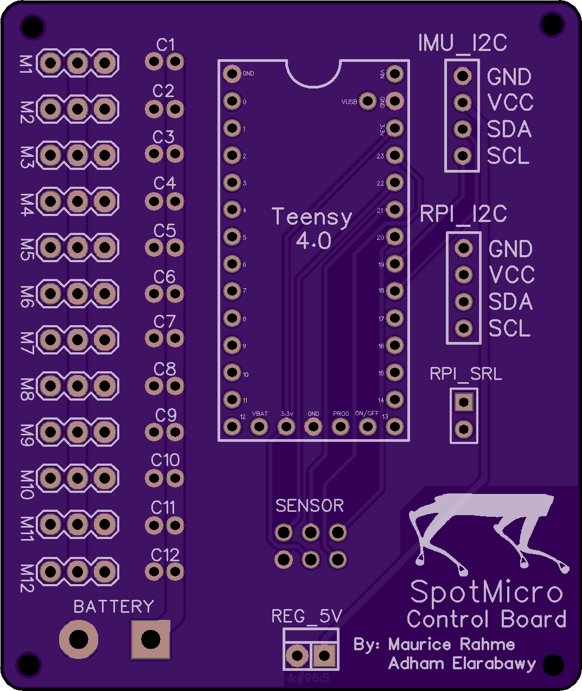
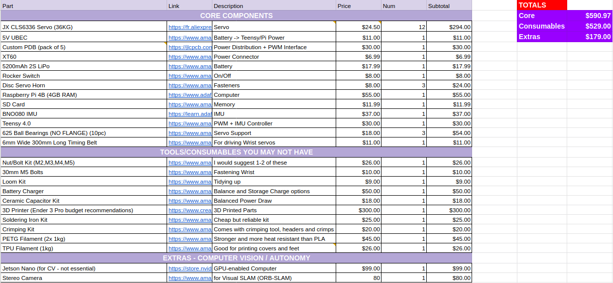

# Spot Mini Mini - The Real Deal

## Software

### Teensy Low Level Speed Controller: `Teensy`

Custom Serialized ROS messages have been built using `ROSSerial` for ROS Melodic. These allow the Teensy to communicate with the Raspberry Pi safely and efficiently. The Teensy firmware is split into multiple header files for Servo Motor Operations, Inverse Kinematics, IMU and Contact Sensor readings, as well as the ROSSerial Interface. Becuase of this split, I have opted to use `PlatformIO` for compilation instead of the Arduino IDE.

The `RPi` directory has some testing scripts which you will most likely not use.

#### Installation Instructions:

* Install `PlatformIO`.
* Install `Ubuntu 18.04` and `ROS Melodic` on Raspberry Pi and well as `ROSSerial`.
* Navigate to [firmware](https://github.com/moribots/spot_mini_mini/tree/spot/spot_real/Control/Teensy/SpotMiniMini) directory and run `platformio run -t upload` while connected to Teensy 4.0.

#### Launch Instructions:

After turning on Spot's power switch, and `ssh`-ing into the Raspberry Pi (assuming you've done all the standard ROS stuff: `source devel/setup.bash` and `catkin_make`), do: `roslaunch mini_ros spot_real.launch`. This will establish the serial connection between the Pi and the Teensy, and you should be able to give Spot joystick commands.

## Hardware

### Power Distribution Board: `PDB`

[Adham Elarabawy](https://github.com/adham-elarabawy/OpenQuadruped/blob/master/README.md) and I designed this Power Distribution Board for the [Spot Micro](https://spotmicroai.readthedocs.io/en/latest/). There are two available versions, one that supports a single power supply (mine - available in the `PDB` directory), and one that supports dual power supplies (his). The second version exists because users who do not use HV servos will need UBECs to buck the 2S Lipo's voltage down to whatever their motors require. In general, these UBECs come with limited current support, which means that two of them are requrired.

This power distribution board has a `1.5mm Track Width` to support up to `6A` at a `10C` temperature increase (conservative estimate). There are also copper grounding planes on both sides of the board to help with heat dissipation, and parallel tracks for the power lines are provided for the same reason. The PDB also includes shunt capactiors for each servo motor to smooth out the power input. You are free to select your own capaciors as recommendations range from `100uF` to `470uF` depending on the motors. Make sure you use electrolytic capacitors. Check out the [EasyEDA Project](https://easyeda.com/adhamelarabawy/PowerDistributionBoard)!

This board interfaces with a sensor array (used for foot sensors on this project) and contains two  I2C terminals and a regulated 5V power rail. At the center of the board is a Teensy 4.0 which communicates with a Raspberry Pi over Serial to control the 12 servo motors and read the analogue sensors. The Teensy allows for motor speed control, but if you don't need this, it defaults at 100deg/sec (you can change this). The Gerber files for the single supply version are in this directory.

### STEP/STL Files for new design:

Together with [Adham Elarabawy](https://github.com/adham-elarabawy/OpenQuadruped), I have a completed a total mechanical redesign of SpotMicro. We call it `OpenQuadruped`! Check out the [STEP](https://cad.onshape.com/documents/9d0f96878c54300abf1157ac/w/c9cdf8daa98d8a0d7d50c8d3/e/fa0d7caf0ed2ef46834ecc24) files here!

Main improvements:
* Shortened the body by 40mm while making more room for our electronics with adapter plates.
* Moved all the servos to the hip to save 60g on the lower legs, which are now actuated using belt-drives.
* Added support bridge on hip joint for added longevity.
* Added flush slots for hall effect sensors on the feet.

### Bill of Materials

See most recent [BOM](https://docs.google.com/spreadsheets/d/1Z4y59K8bY3r_442I70xe564zAFuP0pVIFEJ6bNZaCi0/edit?usp=sharing)!

Note that the actual cost of this project is reflected in the first group of items totalling `590 USD`. For users such as myself who did not own any hobbyist components before this project, I have included an expanded list of required purchases.

### Assembly & Calibration

Please consult  for assembly and calibration instructions.